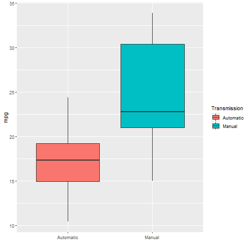

# Regression Model--Motor Trend
In this project we explore the relationship between miles per gallon (MPG) and a set of variables from the Motor Trends car dataset.

## Executive Summary
I work for Motor Trend, a magazine about the automobile industry. Looking at a data set of a collection of cars, they are interested in exploring the relationship between a set of variables and miles per gallon (MPG) (outcome). They are particularly interested in the following two questions:

*“Is an automatic or manual transmission better for MPG”
*“Quantify the MPG difference between automatic and manual transmissions”


## Data Processing


```r
library(ggplot2)
library(GGally)
data("mtcars")
```

As now We have loaded the data in our Environment, Now lets look at the Data set.

```r
head(mtcars)
```

```
##                    mpg cyl disp  hp drat    wt  qsec vs am gear carb
## Mazda RX4         21.0   6  160 110 3.90 2.620 16.46  0  1    4    4
## Mazda RX4 Wag     21.0   6  160 110 3.90 2.875 17.02  0  1    4    4
## Datsun 710        22.8   4  108  93 3.85 2.320 18.61  1  1    4    1
## Hornet 4 Drive    21.4   6  258 110 3.08 3.215 19.44  1  0    3    1
## Hornet Sportabout 18.7   8  360 175 3.15 3.440 17.02  0  0    3    2
## Valiant           18.1   6  225 105 2.76 3.460 20.22  1  0    3    1
```

```r
str(mtcars)
```

```
## 'data.frame':	32 obs. of  11 variables:
##  $ mpg : num  21 21 22.8 21.4 18.7 18.1 14.3 24.4 22.8 19.2 ...
##  $ cyl : num  6 6 4 6 8 6 8 4 4 6 ...
##  $ disp: num  160 160 108 258 360 ...
##  $ hp  : num  110 110 93 110 175 105 245 62 95 123 ...
##  $ drat: num  3.9 3.9 3.85 3.08 3.15 2.76 3.21 3.69 3.92 3.92 ...
##  $ wt  : num  2.62 2.88 2.32 3.21 3.44 ...
##  $ qsec: num  16.5 17 18.6 19.4 17 ...
##  $ vs  : num  0 0 1 1 0 1 0 1 1 1 ...
##  $ am  : num  1 1 1 0 0 0 0 0 0 0 ...
##  $ gear: num  4 4 4 3 3 3 3 4 4 4 ...
##  $ carb: num  4 4 1 1 2 1 4 2 2 4 ...
```
 
Lets Convert the "am" into a categorical Variable.

```r
mtcars$am <- as.factor(mtcars$am)
levels(mtcars$am) <- c("Automatic","Manual")
```


## Exploratory Data Analysis

To get a better understanding of correlation of variable "mpg" and "am", I started my EDA with a Boxplot.

It can be clearly seen that Manual Transmission is better for MPG.


```r
ggplot(mtcars, aes(x= am, y= mpg, fill=am))+geom_boxplot()+labs(fill="Transmission", x=" ")
```




### Quantifying the Difference


```r
ggpairs(mtcars,ggplot2::aes(color=am),
        upper = list(continuous = wrap("smooth", size = 1)),
        lower = list(continuous = wrap("smooth", size = 1)))
```


As we can see multi-collinearity in the above plot, So that means we cannot fit the model with all the variables. 
So we need to select only the important features. So for that We will use step-wise regression method also known as Backwards Regression.


```r
model = step(lm(data = mtcars, mpg ~ . ),trace = FALSE)
summary(model)
```


Intercept is amAutomatic. As now we can clearly see the differnce between Manual and Automatic in Numbers.


### Residual Analysis


```r
plot(model)
```


## Conclusions
From the Above Analysis, both of the Answers are pretty clear.

Boxplot justifies the Answer of first Question. And our step-wise regression technique quantify the difference between Automatic and Manual Transmission i.e.  Cars with manual transmission have 2.9358 (say 3) more miles per gallon than automatic transmissions.


